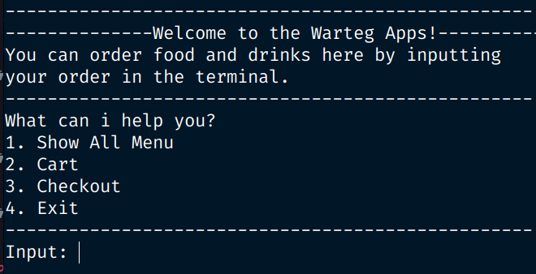

# WARTEG APPS



A command-line interface application for food ordering system built with Go. This CLI tool provides a seamless experience for browsing menus, managing orders, and tracking purchase history. The app use dummy data to provides menus. This app build to implement basic of Go such as slice, struct, pointer, goroutine, wait group, channel, etc.

## ✨ Features

- **📋 Menu Browsing**: View available food items with detailed information
- **🔍 Menu Search**: Find specific dishes quickly with intelligent search functionality
- **🏷️ Filter & Sort**: Filter by categories (cuisine, price range, dietary preferences) and sort by various criteria
- **🛒 Shopping Cart**: Add, remove, and manage items in your cart
- **💳 Checkout System**: Complete orders with integrated checkout process
- **📚 Order History**: Track and view previous orders and purchase history
- **🎨 Interactive UI**: User-friendly command-line interface with intuitive navigation

## 🚀 Quick Start

### Prerequisites

- Go 1.19 or higher
- Terminal/Command Prompt

### Installation

1. **Clone the repository**
   ```bash
   git clone https://github.com/username/fgo24-go-weeklytask.git
   cd fgo24-go-weeklytask
   ```
   
2. **Run the application**
   ```bash
   go run main.go
   ```

<!-- ### Alternative Installation (Go Install)

```bash
go install github.com/username/food-ordering-cli@latest
``` -->
## 📖 Usage

### Basic Commands
**This app use number to navigate. so make sure to follow the instructions carefully.**

## 🏗️ Project Structure

```
fgo24-go-weeklytask/
├── asset/
│   └── home-warteg-apps.png
│   
├── data/                    # dataresources
│   ├── input.go
│   └── list_menu.go
│   
│
├── layout/                  # resources
│   ├── menu_layout.go
│   └── welcome_layout.go
│   
│
├── models/                  # Data models
│   └── menu.go              
│
│
├── utils/                   # utility
│   └── show_menu.go         
│   
├── go.mod                   # Go modules
├── main.go                  # Entry point
└── README.md                # This file
```

## 🛠️ Development

### Prerequisites for Development

- Go 1.19+
- Git


## 🤝 Contributing

We welcome contributions! Please follow these steps:

1. Fork the repository
2. Create a feature branch (`git checkout -b feature/amazing-feature`)
3. Commit your changes (`git commit -m 'Add amazing feature'`)
4. Push to the branch (`git push origin feature/amazing-feature`)
5. Open a Pull Request

### Code Style

- Follow Go standard formatting (`go fmt`)
- Write tests for new features
- Update documentation as needed
- Follow conventional commit messages

## 📝 License

This project is licensed under the MIT License - see the [LICENSE](LICENSE) file for details.

## 👥 Authors

- **devbydenis** - *Initial work* - [YourGitHub](https://github.com/devbydenis)
---